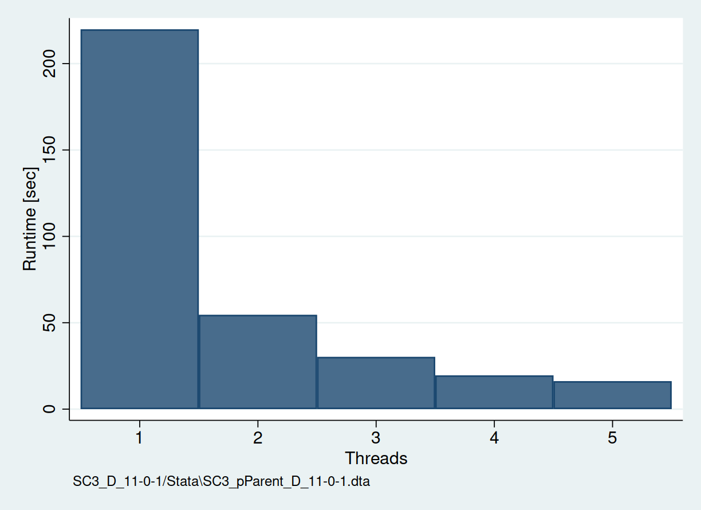

plnepsmiss: run nepsmiss in parallel
======================================================================
_nepsmiss_ is a highly relevant tool to automatically code missing values in Stata for all NEPS starting cohorts. However, the program can be slow as only a single thread is used. _plnepsmiss_ parallelizes the process and speeds computational times up manyfold.

Installation
============

``` stata
. net install plnepsmiss, from(https://raw.github.com/fbittmann/plnepsmiss/stable) replace
```
Note that the packages [parallel](https://github.com/gvegayon/parallel) and [nepstools](https://www.neps-data.de/Data-Center/Overview-and-Assistance/Stata-Tools) are required!

Examples
========

Setup and minimal example
-------------------------
``` stata
use "SC3_D_12-1-0/Stata\SC3_pTarget_D_12-1-0.dta", clear
plnepsmiss, threads(3)

```
Reversing the coding
-------------------------
``` stata
plnepsmiss, threads(3) nepsmissoptions(reverse)

```

Benchmarking
========
To test how much gains can be expected by _plnepsmiss_, a simple benchmark has been conducted (total of 15 simulations). Median times in seconds are computed for using a single thread (standard _nepsmiss_) and _plnepsmiss_ (2 or more threads).
The results indicate that massive gains are possible by parallelization.


Citation
============
Thanks for citing this software as follows:

> Bittmann, Felix (2024): plnepsmiss: Stata module run nepsmiss in parallel. Available from: https://github.com/fbittmann/plnepsmiss
